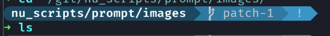
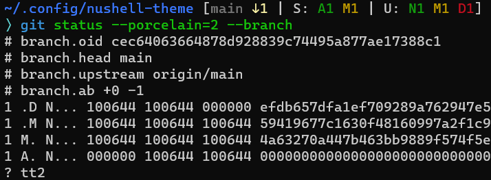

# Prompt Scripts

### Definition

These scripts should be used to draw a custom command prompt in nushell. They can include anything that we think is appropriate for prompts such as `git` commands, `starship`, `oh-my-posh`, etc.

#### starship.nu

File is in [starship](./starship.nu)

This describe how to use starship to make a leftprompt, the repo of starship is [here](https://github.com/starship/starship).

This script set the output of starship as leftprompt



#### shell_space.nu

File is in [shell_space](./shell_space.nu)

Use the function of shells in nu, you can view the function with the command following

```
help shells
```


#### jalon-git.nu
From https://github.com/JalonWong/nushell-prompt

